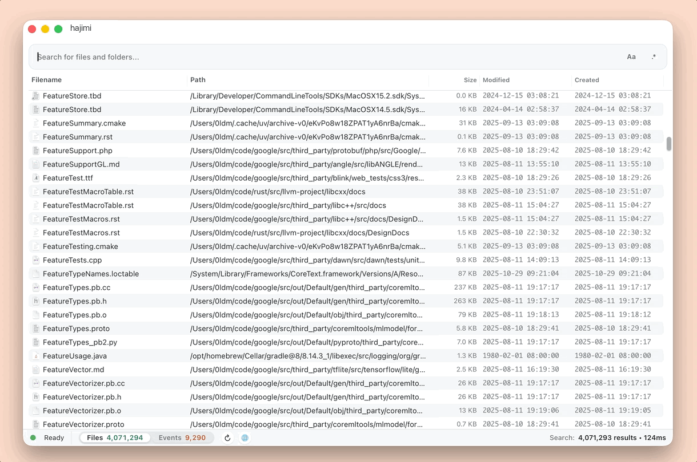

<div align="center">
  
  <h1>hajimi</h1>
  <p>最快又最準的 macOS 檔案搜尋應用程式</p>
  <p>
    <a href="#使用-hajimi">使用 hajimi</a> ·
    <a href="#建置-hajimi">建置 hajimi</a>
  </p>
  
</div>

---

[English](../../README.md) · [Español](README.es-ES.md) · [한국어](README.ko-KR.md) · [Русский](README.ru-RU.md) · [简体中文](README.zh-CN.md) · [繁體中文](README.zh-TW.md) · [Português](README.pt-BR.md) · [Italiano](README.it-IT.md) · [日本語](README.ja-JP.md) · [Français](README.fr-FR.md) · [Deutsch](README.de-DE.md) · [Українська](README.uk-UA.md) · [العربية](README.ar-SA.md) · [हिन्दी](README.hi-IN.md) · [Türkçe](README.tr-TR.md)

## 使用 hajimi

### 下載

請從 [hajimi GitHub Releases](https://github.com/WaveF/hajimi/releases/) 下載最新的 `.dmg` 安裝包。

### 安裝

1. 開啟下載好的 `.dmg` 檔案。
2. 將 `hajimi.app` 拖曳到 `Applications` 資料夾。
3. 從 `Applications` 資料夾開啟 hajimi。

目前的 macOS 版本使用 ad-hoc 簽章，尚未通過 Apple 公證。如果 macOS 阻止開啟，請先嘗試開啟一次，然後前往 **系統設定 → 隱私權與安全性 → 仍要開啟**，確認允許執行。請只對從 hajimi 官方 GitHub Release 下載的 DMG 執行此操作。

如果需要使用命令列，先將應用程式移至 `Applications`，接著可以移除下載檔案的隔離屬性：

```bash
xattr -dr com.apple.quarantine /Applications/hajimi.app
```

### 國際化支援

想切換其他語言？點擊狀態列裡的 ⚙️ 按鈕即可即時切換。

### 基礎搜尋語法

hajimi 現在在經典的子字串/前綴匹配基礎上疊加了 Everything 相容語法：

- `report draft` – 空白代表 `AND`，只會得到同時包含兩個詞的檔案。
- `*.pdf briefing` – 只顯示檔名包含「briefing」的 PDF 結果。
- `*.zip size:>100MB` – 查找大於 100MB 的 ZIP 檔案。
- `in:/Users demo !.psd` – 把搜尋範圍限制在 `/Users`，然後匹配包含 `demo` 但排除 `.psd` 的檔案。
- `tag:ProjectA;ProjectB` – 按 Finder 標籤（macOS）過濾；`;` 表示 `OR`（滿足任一標籤即可）。
- `*.md content:"Bearer "` – 僅篩選包含字串 `Bearer ` 的 Markdown 檔案。
- `"Application Support"` – 使用引號匹配完整片語。
- `brary/Applicat` – 使用 `/` 作為路徑分隔符向下匹配子路徑，例如 `Library/Application Support`。
- `/report` · `draft/` · `/report/` – 在詞首/詞尾添加 `/`，分別強制匹配前綴、後綴或精確檔名，補足 Everything 語法之外的整詞控制。
- `~/**/.DS_Store` – `**` 會深入所有子目錄，在整個家目錄中查找散落的 `.DS_Store` 檔案。

更多支援的運算子（布林組合、資料夾限定、擴充名過濾、正則示例等）請參見 [`search-syntax.zh-TW.md`](search-syntax.zh-TW.md)。

### 鍵盤快捷鍵與預覽

- `Cmd+Shift+Space` – 透過全域快捷鍵開/關 hajimi 視窗。
- `Cmd+,` – 打開偏好設定。
- `Esc` – 隱藏 hajimi 視窗。
- `ArrowUp`/`ArrowDown` – 上下移動選取項目。
- `Shift+ArrowUp`/`Shift+ArrowDown` – 擴展選取範圍。
- `Space` – 不離開 hajimi 即可對目前行執行 Quick Look。
- `Cmd+O` – 打開選中的結果。
- `Cmd+R` – 在 Finder 中定位選中的結果。
- `Cmd+C` – 複製所選檔案到剪貼簿。
- `Cmd+Shift+C` – 複製所選路徑到剪貼簿。
- `Cmd+F` – 焦點回到搜尋框。
- `ArrowUp`/`ArrowDown`（在搜尋框內）– 瀏覽搜尋歷史。

祝你搜尋愉快！

---

## 建置 hajimi

### 環境需求

- macOS 12+
- Rust 工具鏈
- Node.js 18+（附 npm）
- Xcode 命令列工具和 Tauri 依賴（<https://tauri.app/start/prerequisites/>）

### 開發模式

```bash
cd cardinal
npm run tauri dev -- --release --features dev
```

### 生產建置

```bash
cd cardinal
npm run tauri build
```

## 致敬源專案

hajimi 是從 [Cardinal](https://github.com/cardisoft/cardinal) 這個穩固的基礎上繼續長出來的。感謝原專案作者與貢獻者們辛苦打好地基，接下來我們就從這裡繼續慢慢折騰啦。
